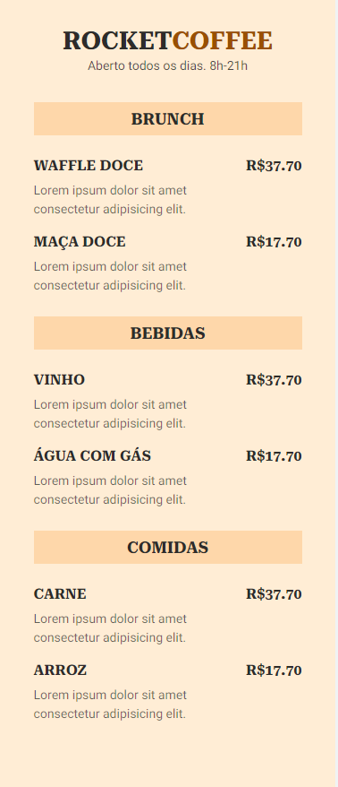

# Rocket-Coffe
 Cardápio digital de um restaurante para ser acessado com qr code. Utilizado apenas HTML e CSS.

## Technology 

Here are the technologies used in this project.

* Ruby version  2.5.1
* Rails version 6.0.2
* SQLite3

## Serviços usados

* Github

## Como usar 
    - Acesse o link usando o código qr

## Screenshot

## Links
  - Repository: https://github.com/Diogovx/Rocket-Coffe

  ## Autor

  * **Diogo Velozo Xavier** 

